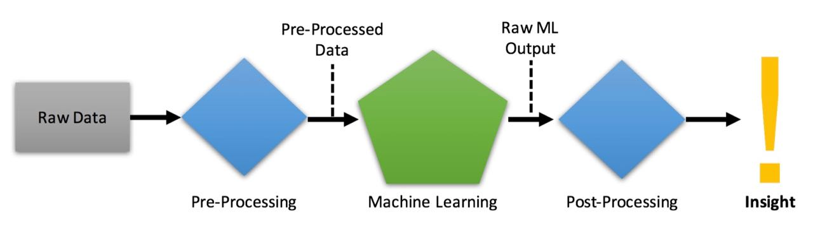
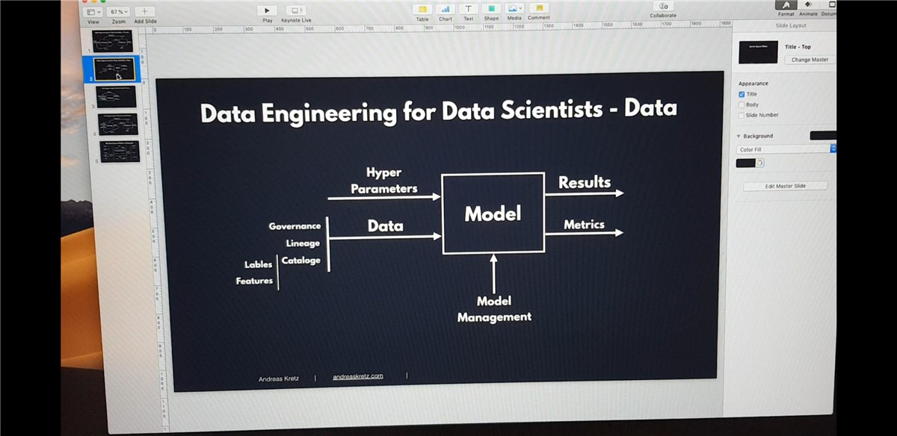

Introduction
============

## Contents

- [How To Use This Cookbook](Introduction.md#how-to-use-this-cookbook)
- [Data Engineer vs Data Scientist](Introduction.md#data-engineer-vs-data-scientist)
  - [Data Scientist](Introduction.md#data-scientist)
    - [Data Scientist Type A](Introduction.md#data-scientist-type-a)
    - [Data Scientist Type A](Introduction.md#data-scientist-type-b)
  - [Data Engineer](Introduction.md#data-engineer)
- [My Big Data Platform Blueprint](Introduction.md#my-big-data-platform-blueprint)
  - [Connect](Introduction.md#connect)
  - [Buffer](Introduction.md#buffer)
  - [Processing Framework](Introduction.md#processing-framework)
  - [Store](Introduction.md#store)
  - [Visualize](Introduction.md#visualize)
- [Who Companies Need](Introduction.md#who-companies-need)

## How To Use This Cookbook

What do you actually need to learn to become an awesome data engineer?
Look no further, you'll find it here.

If you are looking for AI algorithms and such data scientist things,
this book is not for you.

**How to use this document:**\
First of all, this is not a training! This cookbook is a collection of
skills that I value highly in my daily work as a data engineer. It's
intended to be a starting point for you to find the topics to look into
and become an awesome data engineer.

You are going to find ***Five Types of Content*** in this book: Articles
I wrote, links to my podcast episodes (video & audio), more than 200
links to helpful websites I like, data engineering interview questions
and case studies.

**This book is a work in progress!**\
As you can see, this book is not finished. I'm constantly adding new
stuff and doing videos for the topics. But obviously, because I do this
as a hobby my time is limited. You can help making this book even
better.

**Help make this book awesome!**\
If you have some cool links or topics for the cookbook, please become a
contributor on GitHub: <https://github.com/andkret/Cookbook>. Pull the
repo, add them and create a pull request. Or join the discussion by
opening Issues. You can also write me an email any time to
plumbersofdatascience\@gmail.com. Tell me your thoughts, what you value,
what you think should be included, or correct me where I am wrong.

**This Cookbook is and will always be free!**\
I don't want to sell you this book, but please support what you like and
join my Patreon: <https://www.patreon.com/plumbersofds>

Check out this podcast episode where I talk in detail why I decided to
share all this information for free: [\#079 Trying to stay true to
myself and making the cookbook public on
GitHub](https://youtu.be/k1bS5aSPos8)

Data Engineer vs Data Scientist
-------------------------------

| Podcast Episode: #050 Data Engineer, Scientist or Analyst - Which One Is For You?
|-----------------------------------------------------------------------------------
| In this podcast we talk about the differences between data scientists, analysts and engineers. Which are the three main data science jobs. All three are super important. This makes it easy to decide
| [Watch on YouTube](https://youtu.be/64TYZETOEdQ) \ [Listen on Anchor](https://anchor.fm/andreaskayy/episodes/050-Data-Engineer-Scientist-or-Analyst-Which-One-Is-For-You-e45ibl)

### Data Scientist

Data scientists aren't like every other scientist.

Data scientists do not wear white coats or work in high tech labs full
of science fiction movie equipment. They work in offices just like you
and me.

What differs them from most of us is that they are math experts. They
use linear algebra and multivariable calculus to create new insight from
existing data.

How exactly does this insight look?

Here's an example:

An industrial company produces a lot of products that need to be tested
before shipping.

Usually such tests take a lot of time because there are hundreds of
things to be tested. All to make sure that your product is not broken.

Wouldn't it be great to know early if a test fails ten steps down the
line? If you knew that you could skip the other tests and just trash the
product or repair it.

That's exactly where a data scientist can help you, big-time. This field
is called predictive analytics and the technique of choice is machine
learning.

Machine what? Learning?

Yes, machine learning, it works like this:

You feed an algorithm with measurement data. It generates a model and
optimises it based on the data you fed it with. That model basically
represents a pattern of how your data is looking. You show that model
new data and the model will tell you if the data still represents the
data you have trained it with. This technique can also be used for
predicting machine failure in advance with machine learning. Of course
the whole process is not that simple.

The actual process of training and applying a model is not that hard. A
lot of work for the data scientist is to figure out how to pre-process
the data that gets fed to the algorithms.

In order to train a algorithm you need useful data. If you use any data
for the training the produced model will be very unreliable.

A unreliable model for predicting machine failure would tell you that
your machine is damaged even if it is not. Or even worse: It would tell
you the machine is ok even when there is an malfunction.

Model outputs are very abstract. You also need to post-process the model
outputs to receive health values from 0 to 100.

#### Data Scientist Type A

#### Data Scientist Type B

### Data Engineer

Data Engineers are the link between the management's big data strategy
and the data scientists that need to work with data.

What they do is building the platforms that enable data scientists to do
their magic.

These platforms are usually used in five different ways:

-   Data ingestion and storage of large amounts of data

-   Algorithm creation by data scientists

-   Automation of the data scientist's machine learning models and
    algorithms for production use

-   Data visualisation for employees and customers

-   Most of the time these guys start as traditional solution architects
    for systems that involve SQL databases, web servers, SAP
    installations and other "standard" systems.

But to create big data platforms the engineer needs to be an expert in
specifying, setting up and maintaining big data technologies like:
Hadoop, Spark, HBase, Cassandra, MongoDB, Kafka, Redis and more.

What they also need is experience on how to deploy systems on cloud
infrastructure like at Amazon or Google or on-premise hardware.

| Podcast Episode: #048 From Wannabe Data Scientist To Engineer My Journey
|------------------|
|In this episode Kate Strachnyi interviews me for her humans of data science podcast. We talk about how I found out that I am more into the engineering part of data science.  
| [Watch on YouTube](https://youtu.be/pIZkTuN5AMM) \ [Listen on Anchor](https://anchor.fm/andreaskayy/episodes/048-From-Wannabe-Data-Scientist-To-Engineer-My-Journey-e45i2o)|

## Machine Learning Workflow

## Machine Learning Model and Data

## My Big Data Platform Blueprint

Some time ago I have created a simple and modular big data platform
blueprint for myself. It is based on what I have seen in the field and
read in tech blogs all over the internet.

Today I am going to share it with you.

Why do I believe it will be super useful to you?

Because, unlike other blueprints it is not focused on technology. It is
based on four common big data platform design patterns.

Following my blueprint will allow you to create the big data platform
that fits exactly your needs. Building the perfect platform will allow
data scientists to discover new insights.

It will enable you to perfectly handle big data and allow you to make
data driven decisions.

The blueprint is focused on the four key areas: Ingest, store, analyse
and display.

Having the platform split like this turns it it a modular platform with
loosely coupled interfaces.

Why is it so important to have a modular platform?

If you have a platform that is not modular you end up with something
that is fixed or hard to modify. This means you can not adjust the
platform to changing requirements of the company.

Because of modularity it is possible to replace every component, if you
need it.

Now, lets talk more about each key area.

### Connect

Ingestion is all about getting the data in from the source and making it
available to later stages. Sources can be everything from tweets, server
logs to IoT sensor data (e.g. from cars).

Sources send data to your API Services. The API is going to push the
data into a temporary storage.

The temporary storage allows other stages simple and fast access to
incoming data.

A great solution is to use messaging queue systems like Apache Kafka,
RabbitMQ or AWS Kinesis. Sometimes people also use caches for
specialised applications like Redis.

A good practice is that the temporary storage follows the
publish-subscribe pattern. This way APIs can publish messages and
Analytics can quickly consume them.

### Buffer

### Processing Framework

The analyse stage is where the actual analytics is done. Analytics, in
the form of stream and batch processing.

Streaming data is taken from ingest and fed into analytics. Streaming
analyses the "live" data, thus generating fast results.

As the central and most important stage, analytics also has access to
the big data storage. Because of that connection, analytics can take a
big chunk of data and analyse it.

This type of analysis is called batch processing. It will deliver you
answers for the big questions.

To learn more about stream and batch processing read my blog post:
[missing](missing) How to Create New and Exciting Big Data Aided
Products

The analytics process, batch or streaming, is not a one way process.
Analytics also can write data back to the big data storage.

Often times writing data back to the storage makes sense. It allows you
to combine previous analytics outputs with the raw data.

Analytics insight can give meaning to the raw data when you combine
them. This combination will often times allow you to create even more
useful insight.

A wide variety of analytics tools are available. Ranging from MapReduce
or AWS Elastic MapReduce to Apache Spark and AWS lambda.

### Store

This is the typical big data storage where you just store everything. It
enables you to analyse the big picture.

Most of the data might seem useless for now, but it is of upmost
importance to keep it. Throwing data away is a big no no.

Why not throw something away when it is useless?

Although it seems useless for now, data scientists can work with the
data. They might find new ways to analyse the data and generate valuable
insight from it.

What kind of systems can be used to store big data?

Systems like Hadoop HDFS, Hbase, Amazon S3 or DynamoDB are a perfect fit
to store big data.

Check out my podcast how to decide between SQL and NoSQL:
<https://anchor.fm/andreaskayy/embed/episodes/NoSQL-Vs-SQL-How-To-Choose-e12f1o>

### Visualize

Displaying data is as important as ingesting, storing and analysing it.
People need to be able to make data driven decisions.

This is why it is important to have a good visual presentation of the
data. Sometimes you have a lot of different use cases or projects using
the platform.

It might not be possible for you to build the perfect UI that fits
everyone. What you should do in this case is enable others to build the
perfect UI themselves.

How to do that? By creating APIs to access the data and making them
available to developers.

Either way, UI or API the trick is to give the display stage direct
access to the data in the big data cluster. This kind of access will
allow the developers to use analytics results as well as raw data to
build the the perfect application.

## Who Companies Need

For a good company it is absolutely important to get well trained data
engineers and data scientists. Think of the data scientist as the
professional race car driver. A fit athlete with talent and driving
skills like you have never seen.

What he needs to win races is someone who will provide him the perfect
race car to drive. That's what the solution architect is for.

Like the driver and his team the data scientist and the data engineer
need to work closely together. They need to know the different big data
tools inside and out.

That's why companies are looking for people with Spark experience. It is
a common ground between both that drives innovation.

Spark gives data scientists the tools to do analytics and helps
engineers to bring the data scientist's algorithms into production.
After all, those two decide how good the data platform is, how good the
analytics insight is and how fast the whole system gets into a
production ready state.
