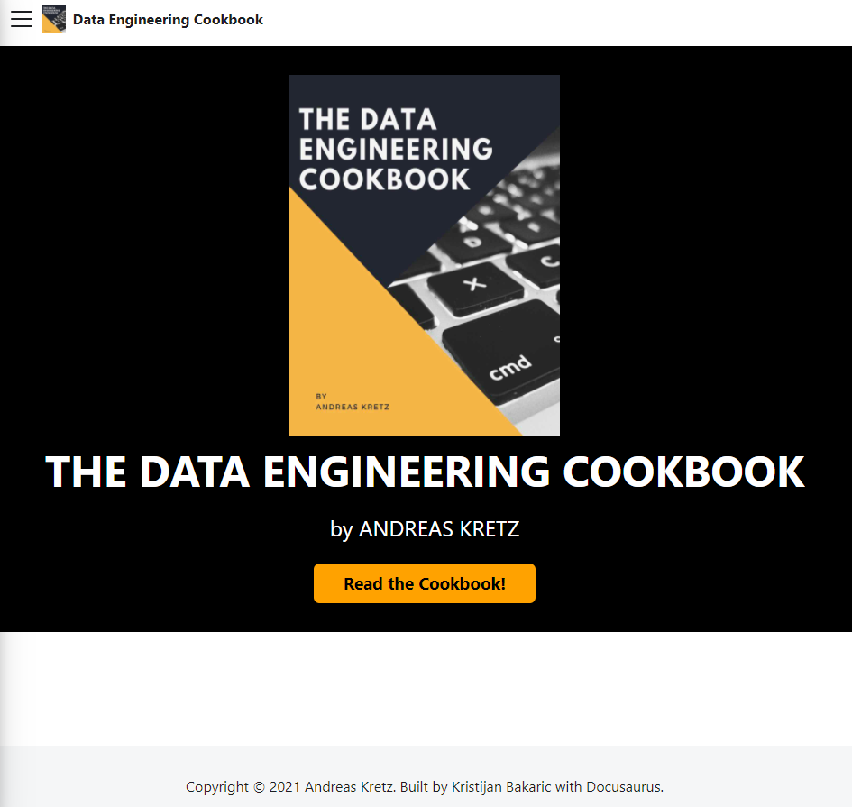
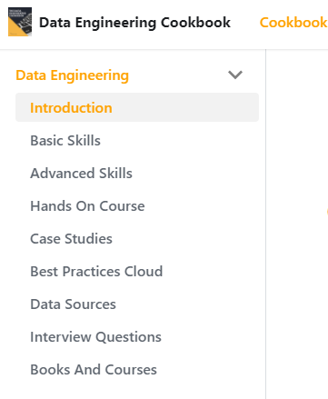

## About the Project

<br />
<p align="center">
  <a href="https://github.com/andkret/Cookbook/tree/documentation">
    
  </a>

  <h3 align="center">The Website for The Data Engineering Cookbook</h3>

  <p align="center">
    This documentation branch is a static website source code and configuration for the data engineering cookbook content made available on the master branch. Built website is made available on gh-pages branch.
    <br />
    <a href="https://github.com/andkret/Cookbook/tree/documentation"><strong>Explore the docs »</strong></a>
    <br />
    <br />
    <a href="https://cookbook.learndataengineering.com/">Link to the Website</a>
    ·
    <a href="https://github.com/andkret/Cookbook/issues">Report Bug</a>
    ·
    <a href="https://github.com/andkret/Cookbook/issues">Request Feature</a>
  </p>
</p>

## Built With

* [Docusaurus](https://docusaurus.io/) - An optimized site generator in React.
* [GitHub Actions](https://github.com/features/actions) - CI/CD automation
* [Markdown](https://en.wikipedia.org/wiki/Markdown#:~:text=Markdown%20is%20a%20lightweight%20markup,using%20a%20plain%20text%20editor.) - book content.


## Getting Started

To get a local development environment follow these simple steps.
Keep in mind that I am developing on WSL2, Ubuntu-20.04.

### Prerequisites

* [nodejs](https://nodejs.org/en/)
* [git](https://git-scm.com/)

### Installation

1. Clone the repo
```sh
git clone https://github.com/andkret/Cookbook.git
```

2. Switch a branch to `documentation` 
```sh
git checkout documentation
```

3. Docusaurus is essentially a set of npm packages that can be installed over npm. Install npm dependencies. It will install all modules listed as dependencies in `package.json`
```sh
npm install
```

[More Information about docusaurus installation.](https://docusaurus.io/docs/installation)

## Development and configuration

### Running the development server

To preview your changes as you edit the files, you can run a local development server that will serve your website and it will reflect the latest changes.

```sh
npm run start
```

By default, a browser window will open at http://localhost:3000.

### Build

Docusaurus is a modern static website generator so we need to build the website into a directory of static contents and put it on a web server so that it can be viewed. To build the website:

```sh
npm run build
```

and contents will be generated within the /build directory, which can be copied to any static file hosting service like GitHub pages, Vercel or Netlify. Check out the docs on deployment for more details.

### Project Structure

**DO NOT CHANGE MARKDOWN CONTENT UNDER `DOCS` DIRECTORY ON THIS BRANCH, DO IT ON THE MASTER BRANCH UNDER `SECTIONS` DIRECTORY**
Reason being is CI/CD automation.

```
CookBook
├── docs
│   ├── doc1.md
│   ├── doc2.md
│   └── mdx.md
├── src
│   ├── css
│   │   └── custom.css
│   └── pages
│       ├── styles.module.css
│       └── index.js
├── static
│   ├── images
│   └── CNAME
├── docusaurus.config.js
├── package.json
├── README.md
└── sidebars.js
```

- `/docs/` - Contains the Markdown files for the docs. Customize the order of the docs sidebar in sidebars.js. More details can be found in the [docs guide](https://docusaurus.io/docs/docs-markdown-features)

- `/src/` - Non-documentation files like pages or custom React components. You don't have to strictly put your non-documentation files in here but putting them under a centralized directory makes it easier to specify in case you need to do some sort of linting/processing.
  - `/pages/` - Any files within this directory will be converted into a website page. More details can be found in the [pages guide](https://docusaurus.io/docs/creating-pages)

- `/static/` - Static directory. Any contents inside here will be copied into the root of the final `build` directory
  
- `/docusaurus.config.js` - A config file containing the site configuration.
  
- `/package.json` -  A Docusaurus website is a React app. You can install and use any npm packages you like in them.
  
- `/sidebar.js` - Used by the documentation to specify the order of documents in the sidebar


### Configuration specifics

- To configure **navbar**


edit `/docusaurus.config.js` file:


- To configure **sidebar content**



edit `/docusaurus.config.js` file:


- To configure **the landing page**


edit `/src/pages/index.js` file:

## Details of CI/CD automation setup

### Workflow

Automation workflow consists of two Github actions as follows:

1) On `master` branch: `Cookbook/.github/workflows/copy-to-documenation-branch.yml`
   
    - on push to master branch, action performs two jobs:
  
      - `copy-sections` job copies all markdown files FROM `/sections/.` directory on `master` branch TO `documentation` branch `/docs/` directory

      - `copy-images` job copies all image files FROM `/images/.` directory on `master` branch TO `documentation` branch `/static/images/` directory

## Roadmap

See the [open issues](https://github.com/andkret/Cookbook/issues) for a list of proposed features (and known issues).

This is currently in a working prototype stage.

## Contributing

Contributions are what make the open source community such an amazing place to be learn, inspire, and create. Any contributions you make are **greatly appreciated**.

1. Become a contributor and clone the project.
2. Create your Feature Branch (`git checkout -b feature/AmazingFeature`)
3. Commit your Changes (`git commit -m 'Add some AmazingFeature'`)
4. Push to the Branch (`git push origin feature/AmazingFeature`)
5. Open a Pull Request.


## License

See the [licence](https://github.com/andkret/Cookbook/blob/master/LICENSE) on the master branch.

## Contact

For author of the cookbook content contact [Andreas Kretz](https://github.com/andkret).

For website related information contact [Kristijan Bakaric](https://github.com/baky0905/).