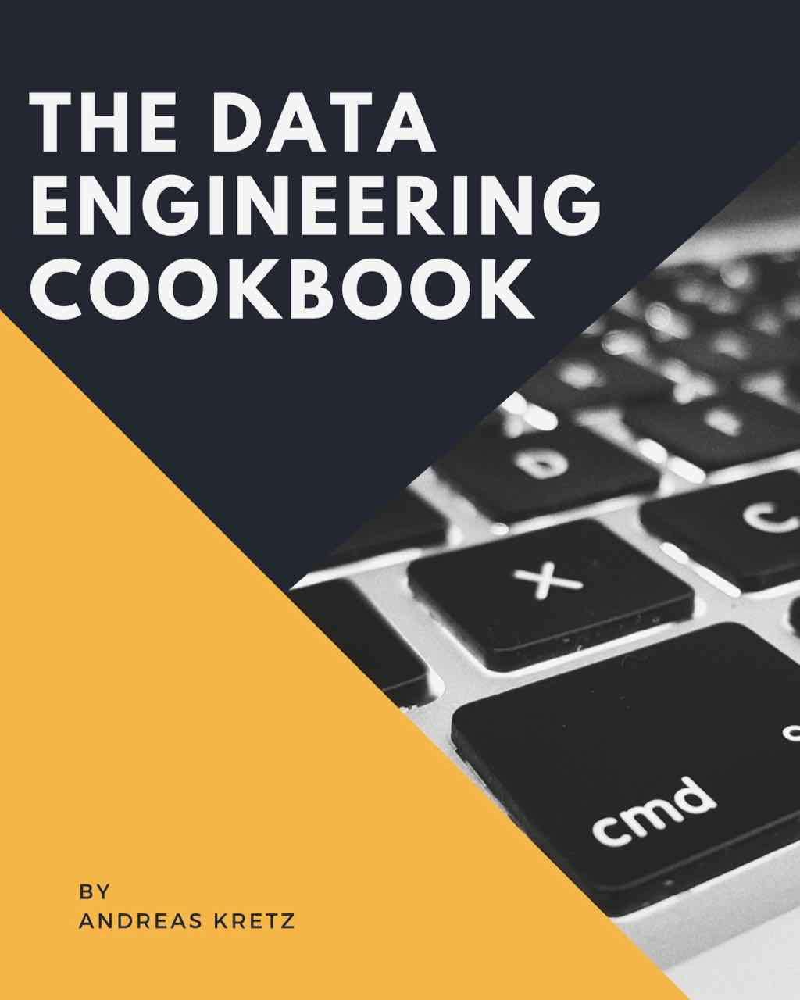

<!--- # The Data Engineering Cookbook -->

	
	 
	 
	 

	<a href="sections/01-Introduction.md">What is this Book?</a>&nbsp;&nbsp;&nbsp;
  <a href="#how-to-contribute">How to Contribute</a>&nbsp;&nbsp;&nbsp;
  <a href="https://www.youtube.com/channel/UCY8mzqqGwl5_bTpBY9qLMAA">YouTube</a>&nbsp;&nbsp;&nbsp;
	<a
  <a href="https://twitter.com/andreaskayy">Twitter</a>&nbsp;&nbsp;&nbsp;
  <a href="https://www.amazon.com/shop/plumbersofdatascience">Amazon Shop</a>

 

## If You Like This Book & Need More Help:
Check out my Data Engineering Academy and personal Coaching at LearnDataEngineering.com

**Visit learndataengineering.com:** [Click Here](https://learndataengineering.com)

- New content every week!
- Step by step course from researching job postings, creating and doing your project to job application tips
- Full AWS Data Engineering example project (Azure in development)
- 1+ hours Ultimate Introduction to Data Engineering course
- Data Engineering Fundamentals course
- Data Platform & Pipeline Design course
- Apache Spark Fundamentals course
- Choosing Data Stores Course
- Private Member Slack Workspace (lifetime access)
- Weekly Q&A live stream & Archive
- Currently over 24 hours of videos

## Support This Book For Free!
- **Amazon:** [Click Here](https://www.amazon.com/shop/plumbersofdatascience) buy whatever you like from Amazon using this link* (Also check out my complete podcast gear and books)

<!---
I get asked super often how to become a Data Engineer.
That's why I decided to start this cookbook with all the topics you need to look into.

It's not only useful for beginners, professionals will definitely like the case study section.

If you look for the old PDF version it's [here](https://github.com/andkret/Cookbook/raw/LaTex-Version-Deprecated/Data%20Engineering%20Cookbook.pdf)

-->

# Contents:
- [Introduction](sections/01-Introduction.md)
- [Basic Engineering Skills](sections/02-BasicSkills.md)
- [Advanced Engineering Skills](sections/03-AdvancedSkills.md)
- [Hands On Course](sections/04-HandsOnCourse.md)‚
- [Case Studies](sections/05-CaseStudies.md)
- [Best Practices Cloud Platforms](sections/06-BestPracticesCloud.md)
- [130+ Data Sources Data Science](sections/07-DataSources.md)
- [1001 Interview Questions](sections/08-InterviewQuestions.md)
- [Recommended Books and Courses](sections/09-BooksAndCourses.md)
<!--  -->

- [How To Contribute](#how-to-contribute)
- [Support What You Like](#support)
- [Important Links](#important-links)

# Full Table Of Contents:
##  Introduction
- [What is this Cookbook](sections/01-Introduction.md#what-is-this-cookbook)
- [Data Engineer vs Data Scientist](sections/01-Introduction.md#data-engineer-vs-data-scientist)
  - [Data Engineer](sections/01-Introduction.md#data-engineer)
  - [Data Scientist](sections/01-Introduction.md#data-scientist)
  - [Machine Learning Workflow](sections/01-Introduction.md#machine-learning-workflow)
  - [Machine Learning Model and Data](sections/01-Introduction.md#machine-learning-model-and-data)
- [My Data Science Platform Blueprint](sections/01-Introduction.md#my-data-science-platform-blueprint)
  - [Connect](sections/01-Introduction.md#connect)
  - [Buffer](sections/01-Introduction.md#buffer)
  - [Processing Framework](sections/01-Introduction.md#processing-framework)
  - [Store](sections/01-Introduction.md#store)
  - [Visualize](sections/01-Introduction.md#visualize)
- [Who Companies Need](sections/01-Introduction.md#who-companies-need)

## Basic Engineering Skills
- [Learn To Code](sections/02-BasicSkills.md#learn-to-code)
- [Get Familiar With Git](sections/02-BasicSkills.md#get-familiar-with-git)
- [Agile Development](sections/02-BasicSkills.md#agile-development)
  - [Why is agile so important?](sections/02-BasicSkills.md#Why-is-agile-so-important)
  - [Agile rules I learned over the years](sections/02-BasicSkills.md#agile-rules-i-learned-over-the-years)
  - [Agile Frameworks](sections/02-BasicSkills.md#agile-frameworks)
    - [Scrum](sections/02-BasicSkills.md#scrum)
    - [OKR](sections/02-BasicSkills.md#okr)
- [Software Engineering Culture](sections/02-BasicSkills.md#software-engineering-culture)
- [Learn how a Computer Works](sections/02-BasicSkills.md#learn-how-a-computer-works)
- [Data Network Transmission](sections/02-BasicSkills.md#data-network-transmission)
- [Security and Privacy](sections/02-BasicSkills.md#security-and-privacy)
  - [SSL Public and Private Key Certificates](sections/02-BasicSkills.md#ssl-public-and-private-key-Certificates)
  - [JSON Web Tokens](sections/02-BasicSkills.md#json-web-tokens)
  - [GDPR regulations](sections/02-BasicSkills.md#gdpr-regulations)
- [Linux](sections/02-BasicSkills.md#linux)
  - [OS Basics](sections/02-BasicSkills.md#os-basics)
  - [Shell scripting](sections/02-BasicSkills.md#shell-scripting)
  - [Cron Jobs](sections/02-BasicSkills.md#cron-jobs)
  - [Packet Management](sections/02-BasicSkills.md#packet-management)
- [Docker](sections/02-BasicSkills.md#docker)
  - [What is Docker and How it Works](sections/02-BasicSkills.md#what-is-docker-and-what-do-you-use-it-for)
    -  [Don't Mess Up Your System](sections/02-BasicSkills.md#dont-mess-up-your-system)
    - [Preconfigured Images](sections/02-BasicSkills.md#preconfigured-images)
    - [Take it With You](sections/02-BasicSkills.md#take-it-with-you)
    - [Kubernetes Container Deployment](sections/02-BasicSkills.md#kubernetes-container-deployment)
    - [How to Create Start and Stop a Container](sections/02-BasicSkills.md#how-to-create-start-stop-a-container)
    - [Docker Micro Services](sections/02-BasicSkills.md#docker-micro-services)
    - [Kubernetes](sections/02-BasicSkills.md#kubernetes)
    - [Why and How To Do Docker Container Orchestration](sections/02-BasicSkills.md#why-and-how-to-do-docker-container-orchestration)
    - [Userful Docker Commands](sections/02-BasicSkills.md#useful-docker-commands)
- [The Cloud](sections/02-BasicSkills.md#the-cloud)
  - [IaaS vs PaaS vs SaaS](sections/02-BasicSkills.md#iaas-vs-paas-vs-saas)
  - [AWS Azure IBM Google IBM](sections/02-BasicSkills.md#aws-azure-ibm-google)
  - [Cloud vs On-Premises](sections/02-BasicSkills.md#cloud-vs-on-premises)
  - [Security](sections/02-BasicSkills.md#security)
  - [Hybrid Clouds](sections/02-BasicSkills.md#hybrid-clouds)
- [Security Zone Design](sections/02-BasicSkills.md#security-zone-design)
  - [How to secure a multi layered application](sections/02-BasicSkills.md#how-to-secure-a-multi-layered-application)
  - [Cluster security with Kerberos](sections/02-BasicSkills.md#cluster-security-with-kerberos)

## Advanced Engineering Skills
- [Data Science Platform](sections/03-AdvancedSkills.md#data-science-platform)
  - [Why a Good Data Platform Is Important](sections/03-AdvancedSkills.md#why-a-good-data-platform-is-important)
  - [Big Data vs Data Science and Analytics](sections/03-AdvancedSkills.md#Big-Data-vs-Data-Science-and-Analytics)
  - [The 4 Vs of Big Data](sections/03-AdvancedSkills.md#the-4-vs-of-big-data)
  - [Why Big Data](sections/03-AdvancedSkills.md#why-big-data)
    - [Planning is Everything](sections/03-AdvancedSkills.md#planning-is-everything)
    - [The Problem with ETL](sections/03-AdvancedSkills.md#the-problem-with-etl)
    - [Scaling Up](sections/03-AdvancedSkills.md#scaling-up)
    - [Scaling Out](sections/03-AdvancedSkills.md#scaling-out)
    - [When not to Do Big Data](sections/03-AdvancedSkills.md#please-dont-go-big-data)
- [Hadoop Platforms](sections/03-AdvancedSkills.md#hadoop-platforms)
  - [What is Hadoop](sections/03-AdvancedSkills.md#what-is-hadoop)
  - [What makes Hadoop so popular](sections/03-AdvancedSkills.md#what-makes-hadoop-so-popular)
  - [Hadoop Ecosystem Components](sections/03-AdvancedSkills.md#hadoop-ecosystem-components)
  - [Hadoop is Everywhere?](sections/03-AdvancedSkills.md#hadoop-is-everywhere)
  - [Should You Learn Hadoop?](sections/03-AdvancedSkills.md#should-you-learn-hadoop)
  - [How to Select Hadoop Cluster Hardware](sections/03-AdvancedSkills.md#how-to-select-hadoop-cluster-hardware)
- [Connect](sections/03-AdvancedSkills.md#connect)
  - [REST APIs](sections/03-AdvancedSkills.md#rest-apis)
    - [API Design](sections/03-AdvancedSkills.md#api-design)
    - [Implemenation Frameworks](sections/03-AdvancedSkills.md#implementation-frameworks)
    - [Security](sections/03-AdvancedSkills.md#security)
  - [Apache Nifi](sections/03-AdvancedSkills.md#apache-nifi)
  - [Logstash](sections/03-AdvancedSkills.md#logstash)
- [Buffer](sections/03-AdvancedSkills.md#buffer)
  - [Apache Kafka](sections/03-AdvancedSkills.md#apache-kafka)
    - [Why a Message Queue Tool?](sections/03-AdvancedSkills.md#why-a-message-queue-tool)
    - [Kafka Architecture](sections/03-AdvancedSkills.md#kafka-architecture)
    - [Kafka Topics](sections/03-AdvancedSkills.md#what-are-topics)
    - [Kafka and Zookeeper](sections/03-AdvancedSkills.md#what-does-zookeeper-have-to-do-with-kafka)
    - [How to Produce and Consume Messages](sections/03-AdvancedSkills.md#how-to-produce-and-consume-messages)
    - [Kafka Commands](sections/03-AdvancedSkills.md#kafka-commands)
  - [Apache Redis Pub-Sub](sections/03-AdvancedSkills.md#redis-pub-sub)
  - [AWS Kinesis](sections/03-AdvancedSkills.md#apache-kafka)
  - [Google Cloud PubSub](sections/03-AdvancedSkills.md#google-cloud-pubsub)
- [Processing Frameworks](sections/03-AdvancedSkills.md#processing-frameworks)
	- [Lambda and Kappa Architecture](sections/03-AdvancedSkills.md#lambda-and-kappa-architecture)
	- [Batch Processing](sections/03-AdvancedSkills.md#batch-processing)
	- [Stream Processing](sections/03-AdvancedSkills.md#stream-processing)
		- [Three Methods of Streaming](sections/03-AdvancedSkills.md#three-methods-of-streaming)
		- [At Least Once](sections/03-AdvancedSkills.md#at-least-once)
		- [At Most Once](sections/03-AdvancedSkills.md#at-most-once)
		- [Exactly Once](sections/03-AdvancedSkills.md#exactly-once)
		- [Check The Tools](sections/03-AdvancedSkills.md#check-the-tools)
	- [Should You do Stream or Batch Processing](sections/03-AdvancedSkills.md#should-you-do-stream-or-batch-processing)
	- [Is ETL still relevant for Analytics?](sections/03-AdvancedSkills.md#is-etl-still-relevant-for-analytics)
  - [MapReduce](sections/03-AdvancedSkills.md#mapreduce)
    - [How Does MapReduce Work](sections/03-AdvancedSkills.md#How-does-mapreduce-work)
    - [MapReduce](sections/03-AdvancedSkills.md#mapreduce)
    - [MapReduce Example](sections/03-AdvancedSkills.md#example)
    - [MapReduce Limitations](sections/03-AdvancedSkills.md#What-is-the-limitation-of-mapreduce)
  - [Apache Spark](sections/03-AdvancedSkills.md#apache-spark)
    - [What is the Difference to MapReduce?](sections/03-AdvancedSkills.md#what-is-the-difference-to-MapReduce)
    - [How Spark Fits to Hadoop](sections/03-AdvancedSkills.md#how-does-spark-fit-to-hadoop)
    - [Spark vs Hadoop](sections/03-AdvancedSkills.md#wheres-the-difference)
    - [Spark and Hadoop a Perfect Fit](sections/03-AdvancedSkills.md#spark-and-hadoop-is-a-perfect-fit)
    - [Spark on YARn](sections/03-AdvancedSkills.md#spark-on-yarn)
    - [My Simple Rule of Thumb](sections/03-AdvancedSkills.md#my-simple-rule-of-thumb)
    - [Available Languages](sections/03-AdvancedSkills.md#available-languages)
    - [Spark Driver Executor and SparkContext](sections/03-AdvancedSkills.md#how-spark-works-driver-executor-sparkcontext)
    - [Spark Batch vs Stream processing](sections/03-AdvancedSkills.md#spark-batch-vs-stream-processing)
    - [How Spark uses Data From Hadoop](sections/03-AdvancedSkills.md#How-does-spark-use-data-from-hadoop)
    - [What are RDDs and How to Use Them](sections/03-AdvancedSkills.md#what-are-rdds-and-how-to-use-them)
    - [SparkSQL How and Why to Use It](sections/03-AdvancedSkills.md#available-languages)
    - [What are Dataframes and How to Use Them](sections/03-AdvancedSkills.md#what-are-dataframes-how-to-use-them)
    - [Machine Learning on Spark (TensorFlow)](sections/03-AdvancedSkills.md#machine-learning-on-spark-tensor-flow)
    - [MLlib](sections/03-AdvancedSkills.md#mllib)
    - [Spark Setup](sections/03-AdvancedSkills.md#spark-setup)
    - [Spark Resource Management](sections/03-AdvancedSkills.md#spark-resource-management)
  - [AWS Lambda](sections/03-AdvancedSkills.md#apache-flink)  
  - [Apache Flink](sections/03-AdvancedSkills.md#apache-flink)
  - [Elasticsearch](sections/03-AdvancedSkills.md#elasticsearch)
  - [Apache Drill](sections/03-AdvancedSkills.md#apache-drill)
  - [StreamSets](sections/03-AdvancedSkills.md#streamsets)
- [Store](sections/03-AdvancedSkills.md#store)
  - [Data Warehouse vs Data Lake](sections/03-AdvancedSkills.md#data-warehouse-vs-data-lake)
  - [SQL Databases](sections/03-AdvancedSkills.md#sql-databases)
    - [PostgreSQL DB](sections/03-AdvancedSkills.md#postgresql-db)
    - [Database Design](sections/03-AdvancedSkills.md#database-design)
    - [SQL Queries](sections/03-AdvancedSkills.md#sql-queries)
    - [Stored Procedures](sections/03-AdvancedSkills.md#stored-procedures)
    - [ODBC/JDBC Server Connections](sections/03-AdvancedSkills.md#odbc-jdbc-server-connections)
  - [NoSQL Stores](sections/03-AdvancedSkills.md#nosql-stores)
    - [HBase KeyValue Store](sections/03-AdvancedSkills.md#keyvalue-stores-hbase)
    - [HDFS Document Store](sections/03-AdvancedSkills.md#document-stores-hdfs)
    - [MongoDB Document Store](sections/03-AdvancedSkills.md#document-stores-mongodb)
    - [Elasticsearch Document Store](sections/03-AdvancedSkills.md#Elasticsearch-search-engine-and-document-store)
    - [Hive Warehouse](sections/03-AdvancedSkills.md#hive-warehouse)
    - [Impala](sections/03-AdvancedSkills.md#impala)
    - [Kudu](sections/03-AdvancedSkills.md#kudu)
    - [Apache Druid](sections/03-AdvancedSkills.md#apache-druid)
    - [InfluxDB Time Series Database](sections/03-AdvancedSkills.md#influxdb-time-series-database)
    - [Greenplum MPP Database](sections/03-AdvancedSkills.md#mpp-databases-greenplum)
- [Visualize](sections/03-AdvancedSkills.md#visualize)
  - [Android and IOS](sections/03-AdvancedSkills.md#android-and-ios)
  - [API Design for Mobile Apps](sections/03-AdvancedSkills.md#how-to-design-apis-for-mobile-apps)
  - [Dashboards](sections/03-AdvancedSkills.md#dashboards)
    - [Grafana](sections/03-AdvancedSkills.md#grafana)
    - [Kibana](sections/03-AdvancedSkills.md#kibana)
  - [Webservers](sections/03-AdvancedSkills.md#how-to-use-webservers-to-display-content)
    - [Tomcat](sections/03-AdvancedSkills.md#tomcat)
    - [Jetty](sections/03-AdvancedSkills.md#jetty)
    - [NodeRED](sections/03-AdvancedSkills.md#nodered)
    - [React](sections/03-AdvancedSkills.md#react)
  - [Business Intelligence Tools](sections/03-AdvancedSkills.md#business-intelligence-tools)
    - [Tableau](sections/03-AdvancedSkills.md#tableau)
    - [Power BI](sections/03-AdvancedSkills.md#power-bi)
    - [Quliksense](sections/03-AdvancedSkills.md#quliksense)
  - [Identity & Device Management](sections/03-AdvancedSkills.md#Identity-and-device-management)
    - [What Is A Digital Twin](sections/03-AdvancedSkills.md#what-is-a-digital-twin)
    - [Active Directory](sections/03-AdvancedSkills.md#active-directory)
- [Machine Learning](sections/03-AdvancedSkills.md#machine-learning)
  - [How to do Machine Learning in production](sections/03-AdvancedSkills.md#how-to-domachine-learning-in-production)
  - [Why machine learning in production is harder then you think](sections/03-AdvancedSkills.md#why-machine-learning-in-production-is-harder-then-you-think)
  - [Models Do Not Work Forever](sections/03-AdvancedSkills.md#models-do-not-work-forever)
  - [Where are The Platforms That Support Machine Learning](sections/03-AdvancedSkills.md#where-are-the-platforms-that-support-this)
  - [Training Parameter Management](sections/03-AdvancedSkills.md#training-parameter-management)
  - [How to Convince People That Machine Learning Works](sections/03-AdvancedSkills.md#how-to-convince-people-machine-learning-works)
  - [No Rules No Physical Models](sections/03-AdvancedSkills.md#no-rules-no-physical-models)
  - [You Have The Data. Use It!](sections/03-AdvancedSkills.md#you-have-the-data-use-it)
  - [Data is Stronger Than Opinions](sections/03-AdvancedSkills.md#data-is-stronger-than-opinions)
  - [AWS Sagemaker](sections/03-AdvancedSkills.md#aws-sagemaker)

## Hands On Course

- [What We Want To Do](sections/04-HandsOnCourse.md#what-we-want-to-do)
- [Thoughts On Choosing A Development Environment](sections/04-HandsOnCourse.md#thoughts-on-choosing-a-development-environment)
- [A Look Into the Twitter API](sections/04-HandsOnCourse.md#a-look-into-the-twiiter-api)
- [Ingesting Tweets with Apache Nifi](sections/04-HandsOnCourse.md#ingesting-tweets-with-apache-nifi)
- [Writing from Nifi to Apache Kafka](sections/04-HandsOnCourse.md#writing-from-nifi-to-kafka)
- [Apache Zeppelin Data Processing](sections/04-HandsOnCourse.md#apache-zeppelin)
  - [Install and Ingest Kafka Topic](sections/04-HandsOnCourse.md#install-and-ingest-kafka-topic)
  - [Processing Messages with Spark & SparkSQL](sections/04-HandsOnCourse.md#processing-messages-with-spark-and-sparksql)
  - [Visualizing Data](sections/04-HandsOnCourse.md#visualizing-data)
- [Switch Processing from Zeppelin to Spark](sections/04-HandsOnCourse.md#switch-processing-from-zeppelin-to-spark)

## Case Studies

- [Data Science @Airbnb](sections/05-CaseStudies.md#data-science-at-Airbnb)
- [Data Science @Amazon](sections/05-CaseStudies.md#data-science-at-Amazon)
- [Data Science @Baidu](sections/05-CaseStudies.md#data-science-at-Baidu)
- [Data Science @Blackrock](sections/05-CaseStudies.md#data-science-at-Blackrock)
- [Data Science @BMW](sections/05-CaseStudies.md#data-science-at-BMW)
- [Data Science @Booking.com](sections/05-CaseStudies.md#data-science-at-Booking.com)
- [Data Science @CERN](sections/05-CaseStudies.md#data-science-at-CERN)
- [Data Science @Disney](sections/05-CaseStudies.md#data-science-at-Disney)
- [Data Science @DLR](sections/05-CaseStudies.md#data-science-at-DLR)
- [Data Science @Drivetribe](sections/05-CaseStudies.md#data-science-at-Drivetribe)
- [Data Science @Dropbox](sections/05-CaseStudies.md#data-science-at-Dropbox)
- [Data Science @Ebay](sections/05-CaseStudies.md#data-science-at-Ebay)
- [Data Science @Expedia](sections/05-CaseStudies.md#data-science-at-Expedia)
- [Data Science @Facebook](sections/05-CaseStudies.md#data-science-at-Facebook)
- [Data Science @Google](sections/05-CaseStudies.md#data-science-at-Google)
- [Data Science @Grammarly](sections/05-CaseStudies.md#data-science-at-Grammarly)
- [Data Science @ING Fraud](sections/05-CaseStudies.md#data-science-at-ING-Fraud)
- [Data Science @Instagram](sections/05-CaseStudies.md#data-science-at-Instagram)
- [Data Science @LinkedIn](sections/05-CaseStudies.md#data-science-at-LinkedIn)
- [Data Science @Lyft](sections/05-CaseStudies.md#data-science-at-Lyft)
- [Data Science @NASA](sections/05-CaseStudies.md#data-science-at-NASA)
- [Data Science @Netflix](sections/05-CaseStudies.md#data-science-at-Netflix)
- [Data Science @OLX](sections/05-CaseStudies.md#data-science-at-OLX)
- [Data Science @OTTO](sections/05-CaseStudies.md#data-science-at-OTTO)
- [Data Science @Paypal](sections/05-CaseStudies.md#data-science-at-Paypal)
- [Data Science @Pinterest](sections/05-CaseStudies.md#data-science-at-Pinterest)
- [Data Science @Salesforce](sections/05-CaseStudies.md#data-science-at-Salesforce)
- [Data Science @Siemens Mindsphere](sections/05-CaseStudies.md#data-science-at-Siemens-Mindsphere)
- [Data Science @Slack](sections/05-CaseStudies.md#data-science-at-Slack)
- [Data Science @Spotify](sections/05-CaseStudies.md#data-science-at-Spotify)
- [Data Science @Symantec](sections/05-CaseStudies.md#data-science-at-Symantec)
- [Data Science @Tinder](sections/05-CaseStudies.md#data-science-at-Tinder)
- [Data Science @Twitter](sections/05-CaseStudies.md#data-science-at-Twitter)
- [Data Science @Uber](sections/05-CaseStudies.md#data-science-at-Uber)
- [Data Science @Upwork](sections/05-CaseStudies.md#data-science-at-Upwork)
- [Data Science @Woot](sections/05-CaseStudies.md#data-science-at-Woot)
- [Data Science @Zalando](sections/05-CaseStudies.md#data-science-at-Zalando)

## Best Practices Cloud Platforms

- [Amazon Web Services (AWS)](sections/06-BestPracticesCloud.md#aws)
  - [Connect](sections/06-BestPracticesCloud.md#Connect)
  - [Buffer](sections/06-BestPracticesCloud.md#Buffer)
  - [Processing](sections/06-BestPracticesCloud.md#Processing)
  - [Store](sections/06-BestPracticesCloud.md#Store)
  - [Visualize](sections/06-BestPracticesCloud.md#Visualize)
  - [Containerization](sections/06-BestPracticesCloud.md#Containerization)
  - [Best Practices](sections/06-BestPracticesCloud.md#Best-Practices)
  - [More Details](sections/06-BestPracticesCloud.md#More-Details)
- [Microsoft Azure](sections/06-BestPracticesCloud.md#azure)
  - [Connect](sections/06-BestPracticesCloud.md#Connect-1)
  - [Buffer](sections/06-BestPracticesCloud.md#Buffer-1)
  - [Processing](sections/06-BestPracticesCloud.md#Processing-1)
  - [Store](sections/06-BestPracticesCloud.md#Store-1)
  - [Visualize](sections/06-BestPracticesCloud.md#Visualize-1)
  - [Containerization](sections/06-BestPracticesCloud.md#Containerization-1)
  - [Best Practices](sections/06-BestPracticesCloud.md#Best-Practices-1)
- [Google Cloud Platform (GCP)](sections/06-BestPracticesCloud.md#gcp)
  - [Connect](sections/06-BestPracticesCloud.md#Connect-2)
  - [Buffer](sections/06-BestPracticesCloud.md#Buffer-2)
  - [Processing](sections/06-BestPracticesCloud.md#Processing-2)
  - [Store](sections/06-BestPracticesCloud.md#Store-2)
  - [Visualize](sections/06-BestPracticesCloud.md#Visualize-2)
  - [Containerization](sections/06-BestPracticesCloud.md#Containerization-2)
  - [Best Practices](sections/06-BestPracticesCloud.md#Best-Practices-2)

## 130+ Free Data Sources For Data Science

- [General And Academic](sections/07-DataSources.md#General-And-Academic)
- [Content Marketing](sections/07-DataSources.md#Content-Marketing)
- [Crime](sections/07-DataSources.md#Crime)
- [Drugs](sections/07-DataSources.md#Drugs)
- [Education](sections/07-DataSources.md#Education)
- [Entertainment](sections/07-DataSources.md#Entertainment)
- [Environmental And Weather Data](sections/07-DataSources.md#Environmental-And-Weather-Data)
- [Financial And Economic Data](sections/07-DataSources.md#Financial-And-Economic-Data])
- [Government And World](sections/07-DataSources.md#Government-And-World)
- [Health](sections/07-DataSources.md#Health)
- [Human Rights](sections/07-DataSources.md#Human-Rights)
- [Labor And Employment Data](sections/07-DataSources.md#Labor-And-Employment-Data)
- [Politics](sections/07-DataSources.md#Politics)
- [Retail](sections/07-DataSources.md#Retail)
- [Social](sections/07-DataSources.md#Social)
- [Travel And Transportation](sections/07-DataSources.md#Travel-And-Transportation)
- [Various Portals](sections/07-DataSources.md#Various-Portals)
- [Source Articles and Blog Posts](sections/07-DataSources.md#Source-Articles-and-Blog-Posts)
- [Free Data Sources Data Science](sections/07-DataSources.md)

## 1001 Interview Questions

- [Interview Questions](sections/08-InterviewQuestions.md)

## Recommended Books and Courses

- [About Books and Courses](sections/09-BooksAndCourses.md#about-books-and-courses)
- [Books](sections/09-BooksAndCourses.md#books)
  - [Languages](sections/09-BooksAndCourses.md#books-languages)
    - [Java](sections/09-BooksAndCourses.md#java)
    - [Python](sections/09-BooksAndCourses.md#Python)
    - [Scala](sections/09-BooksAndCourses.md#Scala)
    - [Swift](sections/09-BooksAndCourses.md#Swift)
  - [Data Science Tools](sections/09-BooksAndCourses.md#books-data-science-tools)
    - [Apache Spark](sections/09-BooksAndCourses.md#apache-spark)
    - [Apache Kafka](sections/09-BooksAndCourses.md#apache-Kafka)
    - [Apache Hadoop](sections/09-BooksAndCourses.md#apache-Hadoop)
    - [Apache HBase](sections/09-BooksAndCourses.md#apache-HBase)
  - [Business](sections/09-BooksAndCourses.md#Books-Business)
    - [The Lean Startup](sections/09-BooksAndCourses.md#the-lean-startup)
    - [Zero to One](sections/09-BooksAndCourses.md#zero-to-one)
    - [The Innovators Dilemma](sections/09-BooksAndCourses.md#the-innovators-dilemma)
    - [Crossing the Chasm](sections/09-BooksAndCourses.md#crossing-the-chasm)
    - [Crush It!](sections/09-BooksAndCourses.md#crush-it!)
  - [Community Recommendations](sections/09-BooksAndCourses.md#Community-Recommendations)
    - [Designing Data-Intensive Applications](sections/09-BooksAndCourses.md#designing-data-intensive-applications)
- [Online Courses](BooksAndCourses#online-courses)
  - [Machine Learning Stanford](sections/09-BooksAndCourses.md#machine-learning-stanford)
  - [Computer Networking](sections/09-BooksAndCourses.md#computer-networking)
  - [Spring Framework](sections/09-BooksAndCourses.md#spring-framework)
  - [IOS App Development Specialization](sections/09-BooksAndCourses.md#ios-app-development-specialization)

## How To Contribute
If you have some cool links or topics for the cookbook, please become a contributor.

Simply pull the repo, add your ideas and create a pull request.
You can also open an issue and put your thoughts there.

Please use the "Issues" function for comments.

## Support

Everything is free, but please support what you like!
Join my Patreon and become a plumber yourself:
[Link to my Patreon](https://patreon.com/plumbersofds)

Or support me and send a message I read on the next livestream through Paypal.me:
[Link to my Paypal.me/feedthestream](https://paypal.me/feedthestream)

## Important Links

Subscribe to my Plumbers of Data Science YouTube channel for regular updates:
[Link to YouTube](https://www.youtube.com/channel/UCY8mzqqGwl5_bTpBY9qLMAA)

Check out my blog and get updated via mail by joining my mailing list:
[andreaskretz.com](https://andreaskretz.com)

I have a Medium publication where you can publish your data engineer articles to reach more people:
[Medium publication](https://link.medium.com/9oi1VDrhPW)

 
*(As an Amazon Associate I earn from qualifying purchases from Amazon
This is free of charge for you, but super helpful for supporting this channel)
